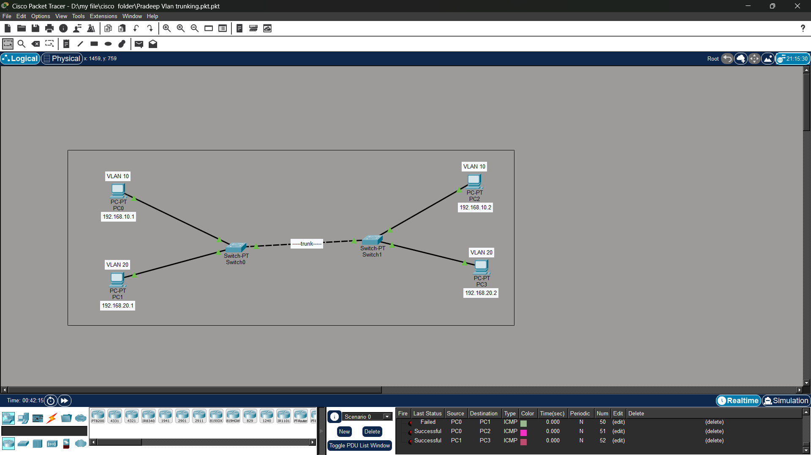

# VLAN Trunking with Cisco Packet Tracer

## About This Project
I built a network with 2 switches and 4 PCs to learn how VLANs work across multiple switches.
Used 802.1Q trunking so that devices in the same VLAN can talk to each other, even if they are on different switches.

## Network Diagram

**What I Configured:**
- VLAN 10: PC0 and PC2 
- VLAN 20: PC1 and PC3
- Trunk link between Switch0 and Switch1

## What I Learned
- How to create VLANs and assign PCs to them
- How trunk ports carry traffic for multiple VLANs
- Devices in same VLAN can communicate across switches
- Devices in different VLANs are separated for security

## Files in This Repo
- `Pradeep Vlan trunking.pkt.pkt` - Open this in Cisco Packet Tracer
- `image.png` - Network topology diagram

## Skills
Cisco Packet Tracer | VLAN | Trunking | Layer 2 Networking
